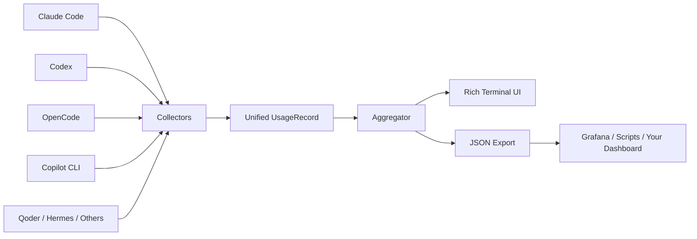

<div align="center">


# LLM Usage Collector

**One local dashboard for usage, tokens, models and cost across your AI coding agents.**  
**一张本地仪表盘，汇总多个 AI Coding Agent 的 Token、模型、会话和费用。**

[](https://www.python.org/)
[](#-privacy--local-first--隐私与本地优先)
[](#-supported-agents--支持的-agent)
[](./LICENSE)

</div>

---

## ✨ Why / 为什么做

**EN**  
AI coding workflows are fragmented. Claude Code, Codex, OpenCode, Copilot CLI, Qoder and other agents all keep usage data in different places and formats. LLM Usage Collector reads those local records and turns them into one consistent report.

**中文**  
AI Coding 工具越来越多，但 Token、模型、会话和费用数据散落在不同的 JSONL、SQLite 和本地目录里。LLM Usage Collector 做的事情很简单：**统一采集，统一统计，统一展示。**

> **No cloud account. No tracking. No manual export.**  
> **不需要云端账号，不上传数据，也不用手工整理账单。**

---

## 🎬 Demo / 演示

<div align="center">

```text
┌──────────────────┐  ┌──────────────────┐
│ 1.77B            │  │ 488.0M / 7.7M   │
│ Total Tokens     │  │ Input / Output   │
└──────────────────┘  └──────────────────┘

┌──────────────────┐  ┌──────────────────┐
│ 1.27B / 1.7M     │  │ $16.98           │
│ Cache R / W      │  │ Total Cost       │
└──────────────────┘  └──────────────────┘
```

</div>

> A short terminal GIF will replace this static preview later.  
> 后续会补一段终端录屏 GIF；当前先保留真实输出结构。

---

## ⚡ Quick Start / 5 分钟快速开始

```bash
git clone https://github.com/Dream22180971/LLM-Usage-Collector.git
cd LLM-Usage-Collector

pip install -r requirements.txt
python main.py
```

That is enough for the first run. The collector automatically scans supported local agent data.

第一次运行不需要额外配置。程序会自动扫描本机已支持的 Agent 数据目录。

### Useful commands / 常用命令

```bash
python main.py --agent claude
python main.py --agent codex
python main.py --days 7
python main.py --json > usage_report.json
```

---

## 🤖 Supported Agents / 支持的 Agent

| Agent | Source / 数据源 | What is collected / 采集内容 |
|---|---|---|
| Claude Code | JSONL | tokens · sessions · models |
| Codex | JSONL | tokens · sessions · models |
| OpenCode | SQLite | usage · cost · sessions |
| GitHub Copilot CLI | JSONL | requests · usage |
| Qoder | JSONL | requests · available token data |
| Hermes Desktop / CLI | SQLite | usage · estimated cost |
| ZCode | SQLite | usage · sessions |
| Pi Agent | JSONL | usage · exact local cost |
| Oh My Pi | JSONL | usage · cost |
| MiMo Desktop | SQLite | usage · sessions |
| DeepSeek Harness | JSON / zstd | usage · sessions |

<details>
<summary><strong>Show local storage paths / 查看本地数据路径</strong></summary>

| Agent | Default path / 默认路径 |
|---|---|
| Claude Code | `~/.claude/projects/**/*.jsonl` |
| Codex | `~/.codex/sessions/**/rollout-*.jsonl` |
| OpenCode | `~/.local/share/opencode/opencode.db` |
| Copilot CLI | `~/.copilot/session-state/**/events.jsonl` |
| Qoder | `~/.qoder-cn/projects/**/*.jsonl` |
| Hermes Desktop | `%LOCALAPPDATA%\Hermes Agent CN Desktop\...\state.db` |
| Hermes CLI | `%LOCALAPPDATA%\hermes\state.db` |
| ZCode | `~/.zcode/cli/db/db.sqlite` |

</details>

---

## 📊 What you get / 你会看到什么

| View | EN | 中文 |
|---|---|---|
| **Overview** | total tokens, requests, sessions, cost | 总 Token、请求数、会话数、费用 |
| **By Agent** | compare agent-level usage | 对比不同 Agent 使用量 |
| **By Model** | see which models consume the most | 查看模型消耗分布 |
| **Daily Trend** | usage over recent days | 最近 N 天趋势 |
| **JSON Output** | feed data into other tools | 输出 JSON 接入其他系统 |

### Example JSON / JSON 输出

```json
{
  "totals": {
    "total_input": 487512098,
    "total_output": 7714591,
    "total_cache_read": 1275984237,
    "total_tokens": 1772918099,
    "total_cost": 16.98,
    "total_requests": 4062,
    "unique_sessions": 295
  }
}
```

---

## 🧩 Architecture / 架构



Each collector converts its source into one shared `UsageRecord` model. New agents can be added without rewriting the reporting layer.

每个采集器只负责把自己的数据源转成统一的 `UsageRecord`。因此新增 Agent 时，不需要重写聚合和展示逻辑。

---

## 🧱 Add a new Agent / 扩展新 Agent

```python
from .base import UsageRecord

class NewAgentCollector:
    name = "NewAgent"

    def collect(self) -> list[UsageRecord]:
        return [
            UsageRecord(
                agent=self.name,
                model="model-name",
                timestamp=datetime.now(),
                input_tokens=12345,
                output_tokens=6789,
            )
        ]
```

Then register it in the collector registry and main entry.

然后在采集器注册处与入口文件中注册即可。

---

## 🔐 Privacy & Local-first / 隐私与本地优先

- Data is read from your local machine only.
- No account system.
- No telemetry server.
- No usage data is uploaded by this project.
- JSON export is opt-in and stays local unless you move it elsewhere.

- 只读取本机数据。
- 不需要注册账号。
- 不接遥测服务器。
- 项目本身不会上传你的 AI 使用数据。
- JSON 导出由你主动执行，文件默认留在本地。

---

## 🗂 Project Structure / 项目结构

```text
LLM-Usage-Collector/
├── main.py
├── aggregator.py
├── display.py
├── collectors/
│   ├── base.py
│   ├── claude.py
│   ├── codex.py
│   ├── opencode.py
│   ├── copilot.py
│   ├── qoder.py
│   ├── hermes.py
│   └── ...
├── reports/
└── requirements.txt
```

---

## 🗺 Roadmap / 路线图

- [x] Multi-agent local collectors / 多 Agent 本地采集
- [x] Agent / model / daily aggregation
- [x] JSON export
- [x] Cross-platform local paths
- [ ] Terminal demo GIF
- [ ] Interactive TUI
- [ ] Cost normalization across providers
- [ ] Pluggable collector interface
- [ ] Optional desktop dashboard
- [ ] Historical snapshots & comparisons

---

## 🤝 Contributing / 贡献

PRs are welcome, especially for:

- new agent collectors
- path compatibility fixes
- cost parsing improvements
- terminal UI improvements
- real-world test fixtures

尤其欢迎新增 Agent 采集器、兼容路径修复、费用解析、终端 UI 和真实数据格式适配。

---

## 📄 License

[MIT](./LICENSE)

<div align="center">

**Your AI coding stack is fragmented. Your usage data does not have to be.**  
**AI Coding 工具可以很多，账单只需要一张。**

</div>
