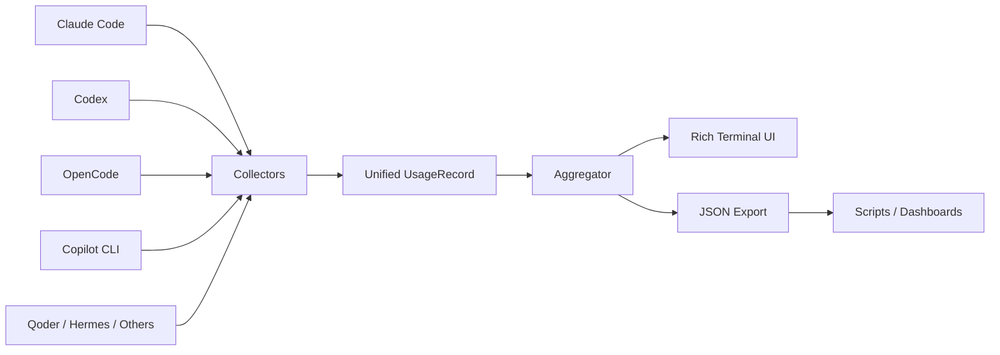

<div align="center">

# LLM Usage Collector

**One local dashboard for usage, tokens, models and cost across your AI coding agents.**

[English](./README.md) | [简体中文](./README.zh-CN.md)

[](https://www.python.org/)
[](#privacy--local-first)
[](#supported-agents)
[](./LICENSE)

</div>

---

## 💡 Why

If you use several AI coding agents, usage data quickly becomes fragmented across JSONL files, SQLite databases and tool-specific directories.

**LLM Usage Collector scans those local records and turns them into one consistent terminal report.**

> No cloud account. No telemetry. No manual spreadsheet.

---

## 🎬 Demo

```text
┌──────────────────┐  ┌──────────────────┐
│ 1.77B            │  │ 488.0M / 7.7M   │
│ Total Tokens     │  │ Input / Output   │
└──────────────────┘  └──────────────────┘

┌──────────────────┐  ┌──────────────────┐
│ 1.27B / 1.7M     │  │ $16.98           │
│ Cache R / W      │  │ Total Cost       │
└──────────────────┘  └──────────────────┘
```

> Next documentation asset: a short terminal GIF showing auto-detection, filtering and JSON export.

---

## ⚡ Quick Start

```bash
git clone https://github.com/Dream22180971/LLM-Usage-Collector.git
cd LLM-Usage-Collector

pip install -r requirements.txt
python main.py
```

The first run automatically scans supported local agent data.

Useful commands:

```bash
python main.py --agent claude
python main.py --agent codex
python main.py --days 7
python main.py --json > usage_report.json
```

---

## 🤖 Supported Agents

| Agent | Source | Collected data |
|---|---|---|
| Claude Code | JSONL | tokens · sessions · models |
| Codex | JSONL | tokens · sessions · models |
| OpenCode | SQLite | usage · cost · sessions |
| GitHub Copilot CLI | JSONL | requests · usage |
| Qoder | JSONL | requests · available token data |
| Hermes Desktop / CLI | SQLite | usage · estimated cost |
| ZCode | SQLite | usage · sessions |
| Pi Agent | JSONL | usage · local cost |
| Oh My Pi | JSONL | usage · cost |
| MiMo Desktop | SQLite | usage · sessions |
| DeepSeek Harness | JSON / zstd | usage · sessions |

<details>
<summary><strong>Show default local paths</strong></summary>

| Agent | Default path |
|---|---|
| Claude Code | `~/.claude/projects/**/*.jsonl` |
| Codex | `~/.codex/sessions/**/rollout-*.jsonl` |
| OpenCode | `~/.local/share/opencode/opencode.db` |
| Copilot CLI | `~/.copilot/session-state/**/events.jsonl` |
| Qoder | `~/.qoder-cn/projects/**/*.jsonl` |
| Hermes Desktop | `%LOCALAPPDATA%\Hermes Agent CN Desktop\...\state.db` |
| Hermes CLI | `%LOCALAPPDATA%\hermes\state.db` |
| ZCode | `~/.zcode/cli/db/db.sqlite` |

</details>

---

## 📊 What you get

| View | Purpose |
|---|---|
| **Overview** | total tokens, requests, sessions and recorded cost |
| **By Agent** | compare usage across coding agents |
| **By Model** | see which models consume the most |
| **Daily Trend** | inspect recent usage over time |
| **JSON Output** | feed normalized data into scripts or dashboards |

Example JSON:

```json
{
  "totals": {
    "total_input": 487512098,
    "total_output": 7714591,
    "total_cache_read": 1275984237,
    "total_tokens": 1772918099,
    "total_cost": 16.98,
    "total_requests": 4062,
    "unique_sessions": 295
  }
}
```

---

## 🧩 Architecture



Each collector converts a tool-specific local format into a shared `UsageRecord`. The reporting layer stays unchanged when a new agent collector is added.

---

## 🧱 Add a new Agent

```python
from .base import UsageRecord

class NewAgentCollector:
    name = "NewAgent"

    def collect(self) -> list[UsageRecord]:
        return [
            UsageRecord(
                agent=self.name,
                model="model-name",
                timestamp=datetime.now(),
                input_tokens=12345,
                output_tokens=6789,
            )
        ]
```

Then register the collector in the project entry points.

---

## 🔐 Privacy & Local-first

- Reads local agent data only.
- No account system.
- No telemetry server.
- This project does not upload usage data.
- JSON export is explicit and stays local unless you move it elsewhere.

---

## 🗂 Project Structure

```text
LLM-Usage-Collector/
├── main.py
├── aggregator.py
├── display.py
├── collectors/
│   ├── base.py
│   ├── claude.py
│   ├── codex.py
│   ├── opencode.py
│   ├── copilot.py
│   ├── qoder.py
│   ├── hermes.py
│   └── ...
├── reports/
└── requirements.txt
```

---

## 🗺 Roadmap

- [x] Multi-agent local collectors
- [x] Agent / model / daily aggregation
- [x] JSON export
- [x] Cross-platform local paths
- [ ] Terminal demo GIF
- [ ] Interactive TUI
- [ ] Cost normalization across providers
- [ ] Pluggable collector interface
- [ ] Optional desktop dashboard
- [ ] Historical snapshots & comparisons

---

## 🤝 Contributing

PRs are especially useful for:

- new agent collectors
- path compatibility fixes
- cost parsing improvements
- terminal UI improvements
- real-world format fixtures

---

## 📄 License

[MIT](./LICENSE)

<div align="center">

**Your AI coding stack is fragmented. Your usage data does not have to be.**

</div>
