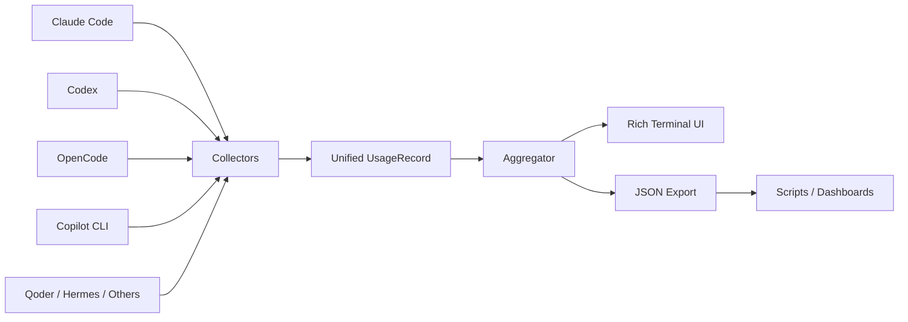

<div align="center">

# LLM Usage Collector

**一张本地仪表盘，汇总多个 AI Coding Agent 的 Token、模型、会话和费用。**

[English](./README.md) | [简体中文](./README.zh-CN.md)

[](https://www.python.org/)
[](#隐私与本地优先)
[](#支持的-agent)
[](./LICENSE)

</div>

---

## 💡 为什么做

同时使用多个 AI Coding Agent 后，用量数据会散落在 JSONL、SQLite 和不同工具自己的本地目录里。

**LLM Usage Collector 自动扫描这些本地记录，把它们统一成一张终端报表。**

> 不需要云端账号，不接遥测，也不用手工整理 Excel。

---

## 🎬 演示

```text
┌──────────────────┐  ┌──────────────────┐
│ 1.77B            │  │ 488.0M / 7.7M   │
│ Total Tokens     │  │ Input / Output   │
└──────────────────┘  └──────────────────┘

┌──────────────────┐  ┌──────────────────┐
│ 1.27B / 1.7M     │  │ $16.98           │
│ Cache R / W      │  │ Total Cost       │
└──────────────────┘  └──────────────────┘
```

> 下一步文档素材：补一段终端 GIF，展示自动识别 Agent、筛选和 JSON 导出。

---

## ⚡ 5 分钟快速开始

```bash
git clone https://github.com/Dream22180971/LLM-Usage-Collector.git
cd LLM-Usage-Collector

pip install -r requirements.txt
python main.py
```

第一次运行会自动扫描本机已经支持的 Agent 数据。

常用命令：

```bash
python main.py --agent claude
python main.py --agent codex
python main.py --days 7
python main.py --json > usage_report.json
```

---

## 🤖 支持的 Agent

| Agent | 数据源 | 采集内容 |
|---|---|---|
| Claude Code | JSONL | Token · 会话 · 模型 |
| Codex | JSONL | Token · 会话 · 模型 |
| OpenCode | SQLite | 用量 · 费用 · 会话 |
| GitHub Copilot CLI | JSONL | 请求 · 用量 |
| Qoder | JSONL | 请求 · 可获得的 Token 数据 |
| Hermes Desktop / CLI | SQLite | 用量 · 估算费用 |
| ZCode | SQLite | 用量 · 会话 |
| Pi Agent | JSONL | 用量 · 本地费用 |
| Oh My Pi | JSONL | 用量 · 费用 |
| MiMo Desktop | SQLite | 用量 · 会话 |
| DeepSeek Harness | JSON / zstd | 用量 · 会话 |

<details>
<summary><strong>查看默认本地路径</strong></summary>

| Agent | 默认路径 |
|---|---|
| Claude Code | `~/.claude/projects/**/*.jsonl` |
| Codex | `~/.codex/sessions/**/rollout-*.jsonl` |
| OpenCode | `~/.local/share/opencode/opencode.db` |
| Copilot CLI | `~/.copilot/session-state/**/events.jsonl` |
| Qoder | `~/.qoder-cn/projects/**/*.jsonl` |
| Hermes Desktop | `%LOCALAPPDATA%\Hermes Agent CN Desktop\...\state.db` |
| Hermes CLI | `%LOCALAPPDATA%\hermes\state.db` |
| ZCode | `~/.zcode/cli/db/db.sqlite` |

</details>

---

## 📊 你会看到什么

| 视图 | 用途 |
|---|---|
| **Overview** | 总 Token、请求数、会话数和已记录费用 |
| **By Agent** | 对比不同 Agent 的使用量 |
| **By Model** | 查看不同模型的消耗分布 |
| **Daily Trend** | 查看最近一段时间的使用趋势 |
| **JSON Output** | 把标准化数据接入脚本或自己的仪表盘 |

---

## 🧩 架构



每个采集器只负责把工具自己的本地格式转成统一的 `UsageRecord`，新增 Agent 时不用重写聚合与展示层。

---

## 🧱 扩展新 Agent

```python
from .base import UsageRecord

class NewAgentCollector:
    name = "NewAgent"

    def collect(self) -> list[UsageRecord]:
        return [
            UsageRecord(
                agent=self.name,
                model="model-name",
                timestamp=datetime.now(),
                input_tokens=12345,
                output_tokens=6789,
            )
        ]
```

完成后把采集器注册到项目入口即可。

---

## 🔐 隐私与本地优先

- 只读取本机 Agent 数据。
- 不需要注册账号。
- 不接遥测服务器。
- 项目本身不会上传使用数据。
- JSON 导出由你主动执行，默认留在本地。

---

## 🗂 项目结构

```text
LLM-Usage-Collector/
├── main.py
├── aggregator.py
├── display.py
├── collectors/
│   ├── base.py
│   ├── claude.py
│   ├── codex.py
│   ├── opencode.py
│   ├── copilot.py
│   ├── qoder.py
│   ├── hermes.py
│   └── ...
├── reports/
└── requirements.txt
```

---

## 🗺 路线图

- [x] 多 Agent 本地采集
- [x] Agent / 模型 / 日期聚合
- [x] JSON 导出
- [x] 多平台本地路径兼容
- [ ] 终端演示 GIF
- [ ] 交互式 TUI
- [ ] 跨供应商费用标准化
- [ ] 可插拔采集器接口
- [ ] 可选桌面仪表盘
- [ ] 历史快照与对比

---

## 🤝 参与贡献

尤其欢迎：

- 新 Agent 采集器
- 本地路径兼容修复
- 费用解析增强
- 终端 UI 改进
- 真实数据格式测试样本

---

## License

[MIT](./LICENSE)

<div align="center">

**AI Coding 工具可以很多，账单只需要一张。**

</div>
